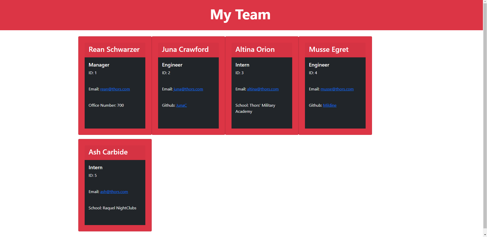

# Team_Profile_Generator

[](https://opensource.org/licenses/MIT)

This is a simple team generator which allows you to organize your employees based on if they are an engineer or an intern. You can add as many engineers and interns as you want after initially adding the manager of the team. Manager's will have their emails and office numbers, Engineers will have their Github linked, and Interns will have information on the school they went to. Installation and steps to install follow.


## Installation

 First you want to clone this repository into your system

  ```
  git clone git@github.com:EajayD/Team_Profile_Generator.git
  ```

  Then you want to install the npm package 

  ```
  npm i inquirer
  npm i jest
  ```

  Once you have the node modules you can run the command below in your terminal to initiate the program

  ```
  node index.js
  ```

  Then check the index.html file in the /dist/ folder to see the generated result

## Built With

* [HTML](https://developer.mozilla.org/en-US/docs/Web/HTML)
* [CSS](https://developer.mozilla.org/en-US/docs/Web/CSS)
* [Git](https://git-scm.com/about)
* [Github](https://github.com/)
* [Javascript](https://developer.mozilla.org/en-US/docs/Web/JavaScript)
* [Bootstrap](https://getbootstrap.com/docs/5.0/getting-started/introduction/)
* [Node.js](https://nodejs.org/en/docs/)
* [Inquirer](https://www.npmjs.com/package/inquirer)
* [Jest](https://jestjs.io/)

## Preview



## Authors

* **Eajay Delos Santos** 

    - [Link to Github](https://github.com/EajayD)
    - [Link to LinkedIn](https://www.linkedin.com/in/eajay-delos-santos-912950214/)

## License
  
 [MIT License](https://opensource.org/licenses/MIT)
  
  ---


## Testing

Below is a link to a walkthrough video of how the generator works

